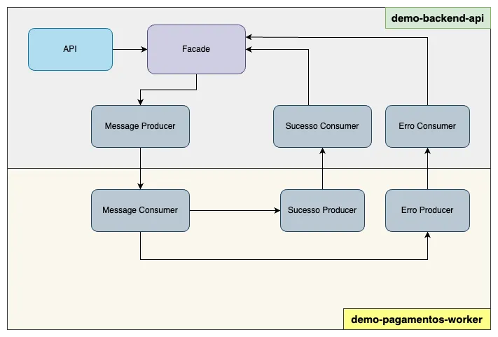
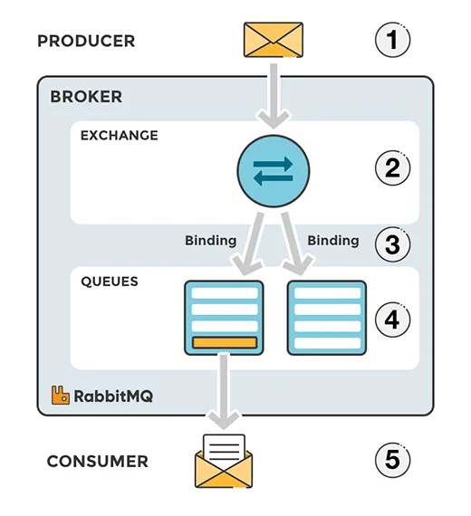

# Spring Boot e RabbitMQ - Tutorial



Este projeto demonstra a implementação de um sistema de mensageria utilizando Spring Boot e RabbitMQ, composto por dois microserviços: uma API de backend e um worker de processamento.

## Estrutura do Projeto

- **demo-backend-api**: Aplicação Spring Boot que expõe endpoints REST e produz mensagens para o RabbitMQ
- **demo-backend-worker**: Aplicação Spring Boot que consome mensagens do RabbitMQ e processa os pagamentos

## Arquitetura

O projeto implementa uma arquitetura de mensageria para processamento assíncrono de pagamentos:

1. O serviço `demo-backend-api` recebe requisições de pagamento através de endpoints REST
2. As requisições são enviadas para uma fila RabbitMQ (`pagamento-request-queue`)
3. O serviço `demo-backend-worker` consome as mensagens da fila e processa os pagamentos
4. Após o processamento, o worker responde com mensagens de sucesso ou erro para filas específicas



## Requisitos

- Java 17
- Maven
- RabbitMQ

## Como Executar

1. Certifique-se de ter o RabbitMQ instalado e em execução:
   ```
   docker run -d --name rabbitmq -p 5672:5672 -p 15672:15672 rabbitmq:3-management
   ```

2. Compile e execute o demo-backend-api:
   ```
   cd demo-backend-api
   mvn spring-boot:run
   ```

3. Compile e execute o demo-backend-worker:
   ```
   cd demo-backend-worker
   mvn spring-boot:run
   ```

## Fluxo de Mensagens

1. **Produtor (API)**: Envia mensagens para a exchange `pagamento-request-exchange` com a routing key `pagamento-request-rout-key`
2. **Consumidor (Worker)**: Consome mensagens da fila `pagamento-request-queue`
3. **Resposta do Worker**:
   - Em caso de sucesso: Publica na exchange `pagamento-sucesso-exchange`
   - Em caso de erro: Publica na exchange `pagamento-erro-exchange`

## Principais Componentes

### API Backend

- `PagamentoRequestProducer`: Produtor de mensagens para o RabbitMQ
- `PagamentoDTO`: Objeto de transferência de dados para pagamentos

### Worker Backend

- `PagamentoRequestConsumidor`: Consumidor de mensagens da fila de requisições
- `PagamentoSucessoProdutor`: Produtor de mensagens de sucesso
- `PagamentoErroProdutor`: Produtor de mensagens de erro

## Por que usar RabbitMQ?

RabbitMQ oferece várias vantagens para este tipo de aplicação:

1. **Processamento Assíncrono**: Permite que o API responda rapidamente ao cliente enquanto o processamento ocorre de forma assíncrona
2. **Escalabilidade**: Facilita a escalabilidade horizontal de workers
3. **Resiliência**: Garante que as mensagens não sejam perdidas mesmo em caso de falhas
4. **Desacoplamento**: Mantém os serviços desacoplados, permitindo evolução independente

## Referências

Este projeto é baseado no tutorial [Spring Boot e RabbitMQ: Como fazer e porquê](https://medium.com/@thiagolenz/tutorial-spring-boot-e-rabbitmq-como-fazer-e-porqu%C3%AA-4a6cc34a3bd1)
